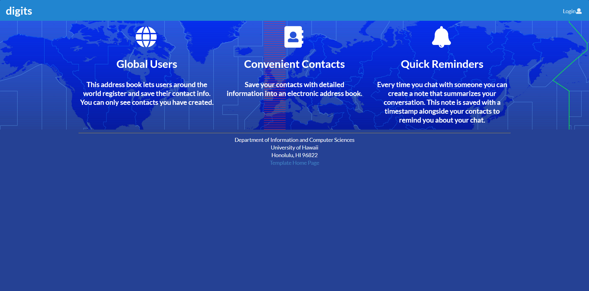
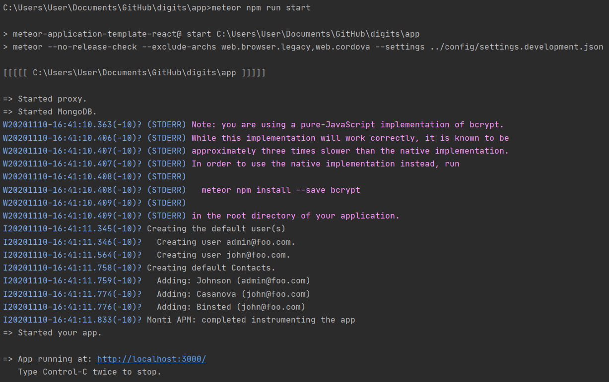
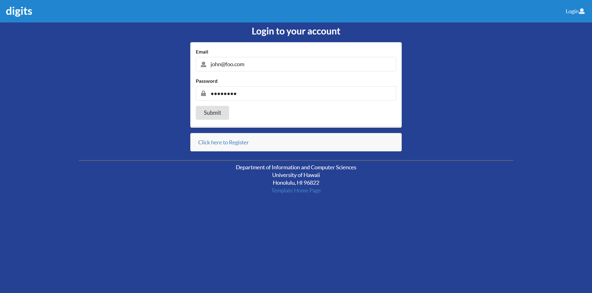
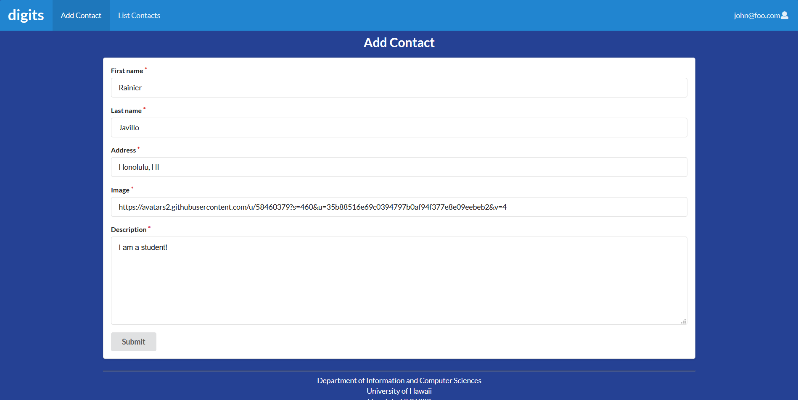
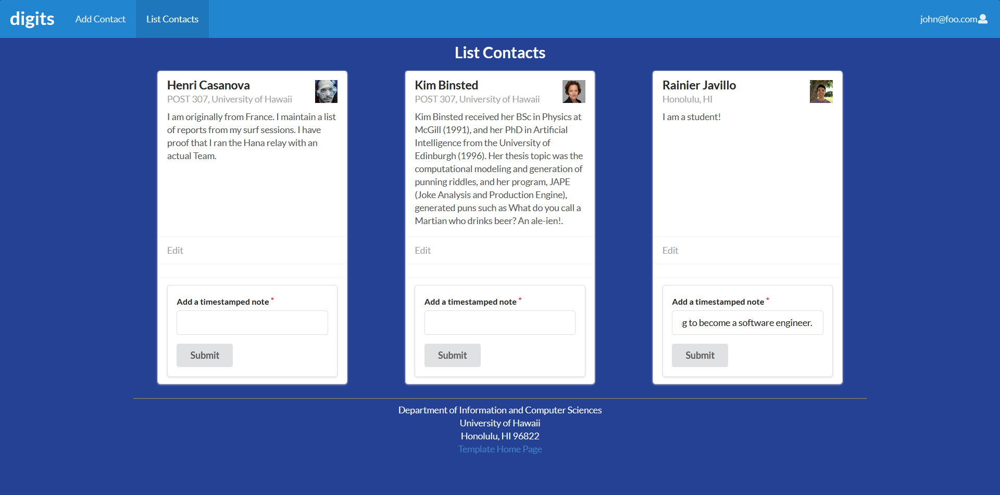
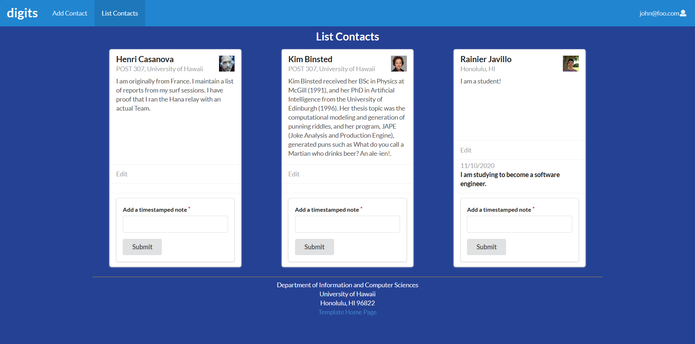
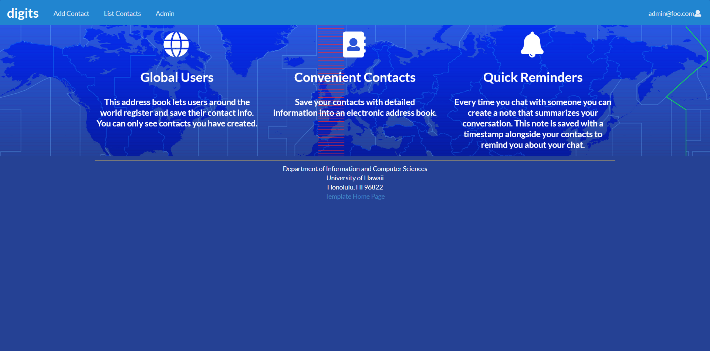
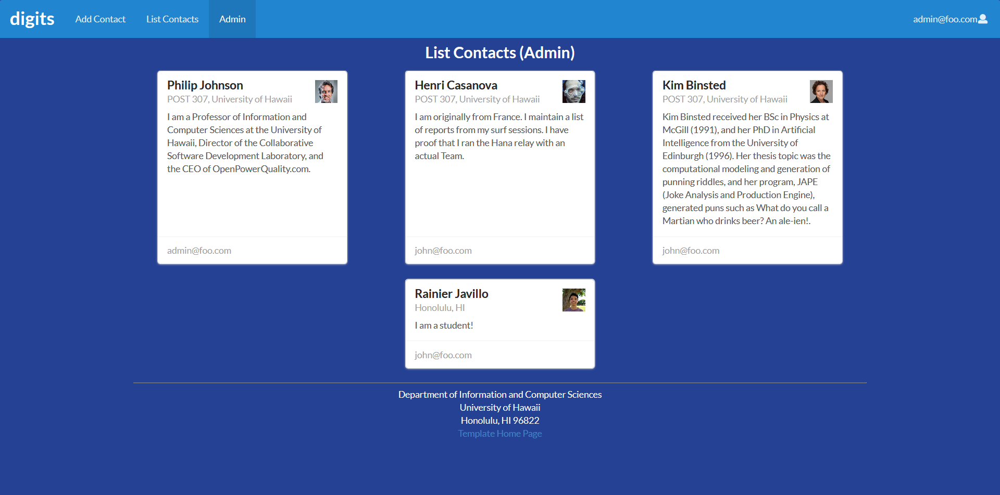

# digits



When a user first enters the site they are presented with a landing page. As the above descriptions say, this side allows a user to:

* Create an online address book where they can add and edit contacts.
* Present these contacts in a detailed and card like manner.
* Append notes to a contact that includes the time it was added for easy reminders. 

## Installation

To use the app, install [Meteor](https://www.meteor.com/install) 

Afterwards, download the [digits repo](https://github.com/rainllo/digits). It's a private repo so you'll need permission to view. 

Once you've done both steps you need to ```cd``` into the ```\digits\app``` directory using your command line. 

Then enter the following commands: 

```meteor npm install```

```meteor npm run start```

If everything was successful your output should like the below image and you can access the site at [http://localhost:3000](http://localhost:3000).



## Tour of the site

### Landing page

As stated before, the user is first presented with the landing site. From here they can click the login button at the top-left corner to enter credentials.  


### Login page

The login page then prompts the user to enter their email address and password. For now we'll sign in as a regular user with username: ```john@foo.com``` and password: ```changeme```.



### Add contact page

Upon logging in two new tabs appear: ```Add Contact``` and ```List Contacts```. Let's go to Add Contact first and create a new contact. For each contact we can include their:

* First name
* Last name
* Address
* Image
* Description

After entering all the relevant info click submit.



### List contacts page

Now, go to the list contacts tab and ta-da! The new contact we created is not a descriptive card. We can also include a timestamped note on an existing contact. Type a note in the text field at the bottom of the card and click submit.



### Timestamped note

The note appears below the contact's description. As can be seen, it also includes a date when the note was made for an easy reminder. 



### Admin page

The pages for Admin are very similar. Just repeat the steps as described in [Login Page](#login-page) but use the following credentials instead:

* username: ```admin@foo.com```
* password: ```changeme```

The landing page is similar for john@foo.com, but now we have a third tab, ```Admin```.



### Admin list contacts page

The Admin tab includes info cards for both regular users and the admin.


